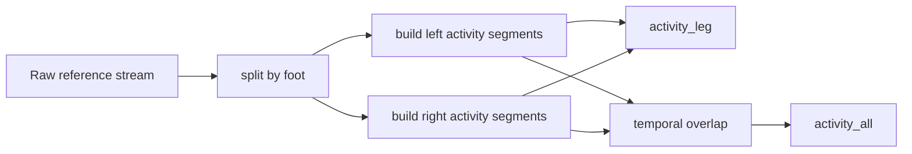

# msCodeID

`msCodeID` implements the first semantic stage of the repository.

It retrieves raw wearable references from InfluxDB, identifies contiguous
activity segments for each foot, and prepares the bilateral semantic structures
later stored as `activity_leg` and `activity_all`.

## Why this package matters

This stage creates the candidate windows that localize where downstream
movement and gait detection should happen. Without it, the gait detector would
need to scan continuous raw telemetry instead of working on already delimited
episodes.

## Bottom-up construction overview

## Responsibilities

The package centers on `CodeIDProcessor`, which is responsible for:

- retrieving raw reference streams for a CodeID
- segmenting left and right activity independently
- building per-leg semantic frames
- computing bilateral temporal overlaps
- preparing the merged bilateral structure consumed later by `msGait`

## Outputs

- `activity_leg`: per-foot semantic activity windows
- `activity_all`: bilateral candidate windows created from left/right overlap

## Relationship to the rest of the repository

- `msCodeID` defines *where* candidate activity exists
- `msGait` later determines *what kind of movement or gait* happened inside
  those candidate windows

## Documentation

- Sphinx package page: [`docs/msCodeID.rst`](../docs/msCodeID.rst)
- CLI page: [`docs/find_mscodeids.rst`](../docs/find_mscodeids.rst)
- architecture page: [`docs/architecture.rst`](../docs/architecture.rst)

## License

MIT. See the root [`LICENSE`](../LICENSE).
