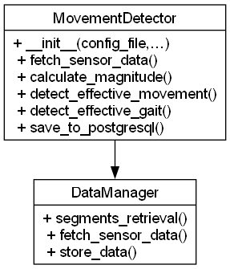

# msGait

Gait signal processing and effective-gait detection for MS Monitoring.

## Architecture Overview



*Class Diagram: `MovementDetector` and its connection to `DataManager`*

## Core Components

- **MovementDetector** (`movement_detector.py`)
  - `__init__(config_file: str, sampling_rate: float, sect: str = "movement", fstart: Optional[str] = None, fend: Optional[str] = None, ids: Optional[List[int]] = None, verbose: int = 1)`
  - `fetch_sensor_data(start_time: str, end_time: str, codeid_id: int, foot: str) -> pandas.DataFrame`
  - `calculate_magnitude(df: pandas.DataFrame) -> pandas.DataFrame`
  - `detect_effective_movement(activity_windows: pandas.DataFrame, nomf: Optional[str] = None, vb: int = 0) -> pandas.DataFrame`
  - `detect_effective_gait(df_effective: pandas.DataFrame, vb: int) -> pandas.DataFrame`
  - `save_to_postgresql(table_name: str, df: pandas.DataFrame, verbose: int) -> None`
  - `close() -> None`

## Requirements

- Python 3.12 or higher
- The **ms_monitoring** package dependencies (installed via `requirements.txt`)

## Configuration

Add a `movement` section to your `config.yaml`:

```yaml
movement:
  # Threshold for the acceleration module (is_effective_by_time)
  accel_threshold: 0.2
  # Threshold for the gyroscope module (is_effective_by_time)
  gyro_threshold: 60
  # Power threshold in the Accel frequency band
  accel_power_threshold: 0.125
  # Power threshold in the Gyro frequency band
  gyro_power_threshold: 1000
  # Frequency band for Welch (Hz)
  freq_band_min: 0.4
  freq_band_max: 1.6
  # Minimum number of peaks within an analysis segment ~ 7s
  min_continuous_hits: 3
```

## Python Usage

```python
from msGait.movement_detector import MovementDetector

# Initialize MovementDetector (it manages DataManager internally)
detector = MovementDetector(
    config_file="config.yaml",
    sampling_rate=50,      # Hz
    ids=[12, 34, 56],      # activity_all IDs (optional)
    verbose=1
)

# Detect effective movements (per leg)
df_effective = detector.detect_effective_movement(
    activity_windows=detector.df_legs,
    nomf="raw_output.xlsx",  # optional Excel export
    vb=2
)

# Detect bipedal gait episodes
df_gait = detector.detect_effective_gait(df_effective, vb=1)

# Save to PostgreSQL (optional)
detector.save_to_postgresql("effective_movement", df_effective, verbose=1)
detector.save_to_postgresql("effective_gait", df_gait, verbose=1)

# Close DB connections
detector.close()
```

## Command-Line Usage

You can also run the full CLI:

```bash
# Process explicit activity_all IDs
python -m ms_monitoring.find_gait \
  -c config.yaml \
  -i 12,34,56 \
  -l en \
  --output raw_output.xlsx \
  --save 1 \
  -v 2

# If -i/--ids is omitted, process the last N hours (default: 25)
python -m ms_monitoring.find_gait \
  -c config.yaml \
  --hours-back 48 \
  -l en \
  --save 0 \
  -v 1
```

**Options**
- `-c, --config`  (YAML path; required)
- `-i, --ids`     Range/list of `activity_all` IDs: `1-271` or `1,5,10-15`
- `--hours-back`  If `--ids` is omitted, look back the last N hours (default: 25)
- `-l, --lang`    Interface language (`en`/`es`, default `es`)
- `--output`      Export raw sensor data to XLSX
- `--head-rows`   Rows to preview when `-v ≥ 2` (default 8)
- `--save`        Persist (`--save 1`, default) or dry-run (`--save 0`)
- `-v, --verbose` Verbosity level (0–2)

## Documentation

Full Sphinx-generated docs live in [`docs/msGait.rst`](../docs/msGait.rst). To rebuild:

```bash
cd docs
make html
```

## License

MIT. See [LICENSE](../LICENSE).
