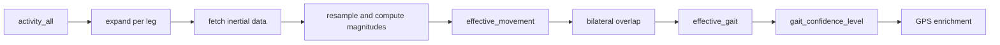

# msGait

`msGait` implements the movement and gait detection stage of the repository.

It consumes semantic candidate windows from `activity_all`, retrieves raw
inertial and GPS data, detects per-leg movement, derives bilateral gait, and
assigns a gait confidence level before optional persistence.

## Why this package matters

This package is where blind signal processing becomes clinically meaningful.
It does not identify named tests directly. Instead, it produces reusable
semantic evidence that later supports post-hoc compatibility analysis.

## Detection overview



## Responsibilities

The package centers on `MovementDetector`, which is responsible for:

- loading candidate bilateral windows
- reconstructing one row per leg
- fetching inertial and GPS data from InfluxDB
- resampling irregular telemetry
- detecting `effective_movement`
- deriving bilateral `effective_gait`
- assigning `gait_confidence_level`
- validating gait with GPS-derived metrics
- optionally storing outputs in PostgreSQL

## Confidence semantics

`effective_gait` now carries graded evidence:

- `gait_confidence_level = 1`: brief bilateral gait
- `gait_confidence_level = 2`: robust bilateral gait

This makes short bilateral episodes visible without forcing them into the same
category as stronger gait segments.

## Configuration highlights

The package reads its parameters from the `movement` section of `config.yaml`.
The current defaults relevant to the new semantics are:

```yaml
movement:
  min_effective_duration_sec: 3.0
  min_gait_duration_sec: 6.0
```

Interpretation:

- shorter per-leg movement episodes are preserved
- robust bilateral gait still requires the stricter threshold
- brief bilateral gait is now reported explicitly through the confidence level

## Outputs

### `effective_movement`

Per-leg movement intervals.

### `effective_gait`

Bilateral gait intervals with:

- start and end timestamps
- duration
- `gait_confidence_level`
- GPS enrichment (`gps_points`, `gps_distance_m`, `gps_elapsed_sec`, `gps_avg_speed_m_s`, `gps_validated`)

## Documentation

- Sphinx package page: [`docs/msGait.rst`](../docs/msGait.rst)
- CLI page: [`docs/find_gait.rst`](../docs/find_gait.rst)
- architecture page: [`docs/architecture.rst`](../docs/architecture.rst)

## License

MIT. See [LICENSE](../LICENSE).
