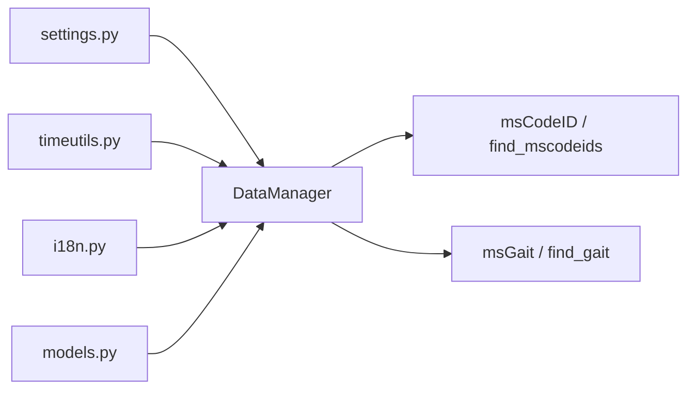

# msTools

Shared infrastructure for the MS Monitoring repository.

`msTools` is the integration substrate used by the rest of the codebase. It
centralizes configuration loading, UTC normalization, translations, typed data
models, and database access for both InfluxDB and PostgreSQL.

## Why this package matters

The repository has two executable stages, but both depend on the same core
services:

- connection management
- configuration loading
- timezone handling
- semantic row validation
- idempotent persistence

That common layer lives in `msTools`.

## Package overview

## Main responsibilities

`DataManager` is the central class of the package. It is responsible for:

- loading `config.yaml` with optional `.env` overrides
- opening and closing PostgreSQL and InfluxDB connections
- retrieving CodeIDs and raw references from InfluxDB
- retrieving `activity_all` windows from PostgreSQL
- expanding bilateral windows into per-leg rows
- validating rows with Pydantic before insertion
- storing semantic tables with idempotent behavior
- ensuring `effective_gait` can persist `gait_confidence_level`
- updating GPS enrichment fields for existing `effective_gait` rows

## Main modules

### `data_manager.py`

Provides the integration class used across the repository.

### `settings.py`

Provides typed configuration loading and override precedence:

1. environment variables
2. `.env`
3. `config.yaml`

### `models.py`

Defines shared Pydantic models used before PostgreSQL insertion.

### `timeutils.py`

Provides `ensure_utc(...)`, which normalizes timestamps before database access.
Naive timestamps are interpreted as Europe/Madrid local time and converted to
UTC.

### `i18n.py`

Provides gettext-based translation helpers for CLI output.

## How it fits into the pipeline

### Stage 1 support

- query raw references from InfluxDB
- transform `activity_leg` rows
- persist `codeids`, `activity_leg`, and `activity_all`

### Stage 2 support

- read `activity_all`
- expand bilateral windows into leg-wise rows
- persist `effective_movement`
- persist `effective_gait` with GPS enrichment and `gait_confidence_level`

## Storage note

`effective_gait` is no longer only a duration-based gait table. It now stores
both enrichment fields and a graded confidence semantic:

- `gait_confidence_level = 1`: brief bilateral gait
- `gait_confidence_level = 2`: robust bilateral gait

## Documentation

- Sphinx package page: [`docs/msTools.rst`](../docs/msTools.rst)
- repository architecture: [`docs/architecture.rst`](../docs/architecture.rst)

## License

MIT. See the root [`LICENSE`](../LICENSE).
