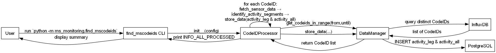
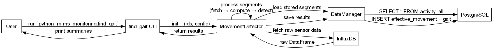

[← Project Home](../README.md)

# ms_monitoring

Command-line tools for extracting and processing wearable activity data
in multiple sclerosis monitoring studies.

## High-Level Workflow

### 1. find_mscodeids



### 2. find_gait



## Requirements

- Python 3.12 or higher
- A `config.yaml` in the project root defining your InfluxDB and PostgreSQL connections:

  ```yaml
  influxdb:
    url:      "https://<host>:8086"
    token:    "<YOUR_TOKEN>"
    org:      "<ORG>"
    bucket:   "<BUCKET>"
    measurement: "<MEASUREMENT>"
    verify:   false
    timeout:  900000

  postgresql:
    host:     "<PG_HOST>"
    port:     5432
    user:     "<USER>"
    password: "<PASSWORD>"
    database: "<DB_NAME>"
  ```

## Installation

```bash
# From the repository root:
pip install -r requirements.txt
```

## Usage

### 1. find_mscodeids

Extracts unique device CodeIDs, identifies activity segments (“Left” & “Right” foot),
and writes to PostgreSQL tables `activity_leg` and `activity_all`.

```bash
python -m ms_monitoring.find_mscodeids   -c config.yaml   [-f "YYYY-MM-DD HH:MM:SS"]   [-u "YYYY-MM-DD HH:MM:SS"]   [-l en]   [--save 0|1]   [-v N]   [--head-rows M]
```

- `-c, --config`   Path to YAML config (required).
- `-f, --from`     Start datetime (default: yesterday at 00:00:00).
- `-u, --until`    End datetime (default: now).
- `-l, --lang`     Interface language (`en`, `es`; default: `es`).
- `--save`         Persist results (`--save 1`, default) or dry-run (`--save 0`).
- `-v, --verbose`  Verbosity level (0–3+).
- `--head-rows`    Rows to preview when `-v ≥ 2` (default: 5).

### 2. find_gait

Processes stored activity segments, applies power/time-based checks
to detect effective movements and gait, and optionally saves results.

```bash
# Option A: explicit activity_all IDs
python -m ms_monitoring.find_gait   -c config.yaml   -i "1,5,10-15"   [-l en]   [--output raw_data.xlsx]   [--head-rows N]   [--save 0|1]   [-v N]

# Option B: if -i/--ids is omitted, process the last N hours (default: 25)
python -m ms_monitoring.find_gait   -c config.yaml   [--hours-back N]   [-l en]   [--output raw_data.xlsx]   [--head-rows N]   [--save 0|1]   [-v N]
```

- `-c, --config`     Path to YAML config (required).
- `-i, --ids`        Range/list of `activity_all` IDs. Formats: `1-271` or `1,5,10-15`.
- `--hours-back`     If `--ids` is omitted, look back the last N hours (default: 25).
- `-l, --lang`       Interface language (`en`, `es`; default: `es`).
- `--output`         Optional XLSX export of raw sensor data.
- `--head-rows`      Rows to preview when `-v ≥ 2` (default: 8).
- `--save`           Persist results (`--save 1`, default) or dry-run (`--save 0`).
- `-v, --verbose`    Verbosity level (0–2).

## SQL Schema Extension

In addition to the standard tables (`codeids`, `activity_leg`, `activity_all`,
`effective_movement`), the following table is created to store gait episodes:

```sql
CREATE TABLE IF NOT EXISTS effective_gait (
  id          SERIAL PRIMARY KEY,
  codeid_id   INT REFERENCES codeids(id),
  start_time  TIMESTAMPTZ NOT NULL,
  end_time    TIMESTAMPTZ NOT NULL,
  duration    NUMERIC NOT NULL
);
CREATE INDEX IF NOT EXISTS idx_effective_gait_codeid
  ON effective_gait(codeid_id);
```

## License

This project is released under the **MIT License**. See the `LICENSE` file for details.
