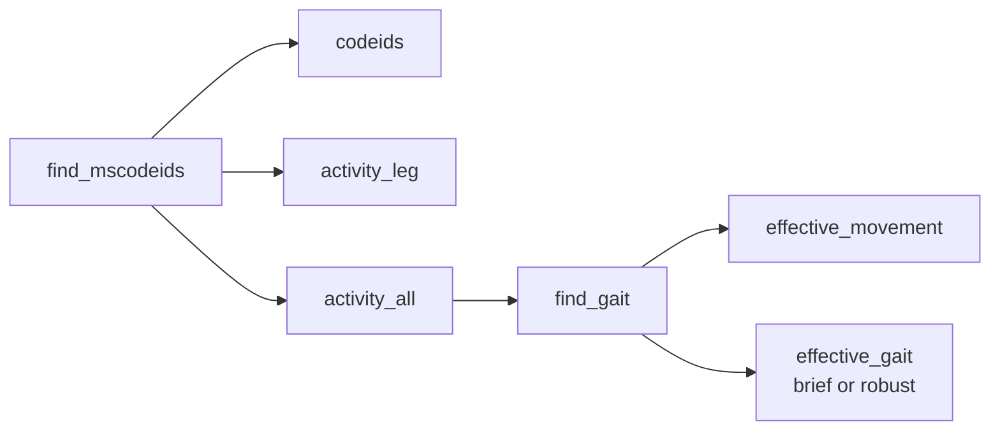

[← Project Home](../README.md)

# ms_monitoring

`ms_monitoring` contains the CLI entry points that execute the two processing
stages of the repository.

## CLI responsibilities

- `check_user_tokens_multi`: fast operational inventory of newly observed `CodeID` values
- `find_mscodeids`: stage 1, bottom-up semantic construction
- `find_gait`: stage 2, movement and graded gait detection
- `run_daily_pipeline`: closed-window daily orchestration for cron

## Execution overview

## `find_mscodeids`

The first executable stage:

- retrieves distinct `CodeID` values from InfluxDB
- fetches wearable reference data
- builds `activity_leg`
- merges bilateral overlaps into `activity_all`
- updates optional `codeids.first_seen_at` and `codeids.last_seen_at`
  from the observed raw-data window when the schema supports it

## `find_gait`

The second executable stage:

- reads `activity_all` or `effective_movement` from PostgreSQL
- reconstructs one row per leg (or uses existing movement data)
- fetches inertial and GPS data (full mode only)
- detects `effective_movement` (full mode only)
- derives `effective_gait`
- enriches gait with GPS metrics
- persists `gait_confidence_level` alongside gait rows

### Execution modes

`find_gait` supports two modes via `--mode`:

1. **`full` (default)**: Complete pipeline
   - Retrieves `activity_all` from PostgreSQL by ID or time window
   - Computes `effective_movement` from leg data
   - Saves `effective_movement` to PostgreSQL (optional)
   - Computes bilateral `effective_gait` from movement
   - Saves only missing gait records to PostgreSQL (idempotent)

2. **`fill-gait`**: Backfill mode
   - Reads existing `effective_movement` from PostgreSQL
   - Identifies movement records without corresponding gait
   - Computes `effective_gait` **only for missing entries**
   - Saves only newly computed gait to PostgreSQL (fast, incremental)
   - Requires `--hours-back` or `-i` for time/ID filtering

Use `--mode fill-gait` to efficiently compute gait for historical effective_movement
records that were already calculated but lack corresponding gait entries.

## Semantic note

The gait stage now produces graded bilateral evidence:

- level 1: brief gait
- level 2: robust gait

This is especially useful when later compatibility reports compare blind
detections against short and long clinical tests. In those reports, clinical
tests should be understood as annotated time intervals aligned with the semantic
event stream, not as primary labels used by the blind detector itself.

## Documentation

- CLI stage 1: [`docs/find_mscodeids.rst`](../docs/find_mscodeids.rst)
- CLI stage 2: [`docs/find_gait.rst`](../docs/find_gait.rst)
- architecture: [`docs/architecture.rst`](../docs/architecture.rst)

## License

MIT. See the root `LICENSE` file for details.

## `check_user_tokens_multi`

The fast inventory command:

- scans one or more InfluxDB buckets for recently observed `CodeID` values
- updates the repository PostgreSQL database without building semantic windows
- is intended for frequent cron execution and Grafana visibility
- preserves the semantic rule that one row in `codeids` still represents one `codeid`

If the `codeids` table has been extended, the command can maintain:

- `type`
- `bucket`
- `first_seen_at`
- `last_seen_at`

## `run_daily_pipeline`

The daily orchestration command:

- computes the previous closed day in `Europe/Madrid` by default
- runs `find_mscodeids` with explicit `from` and `until` values
- retrieves the matching `activity_all` IDs from PostgreSQL
- runs `find_gait` on those IDs in deterministic batches

This is the recommended foundation for the production cron job that rebuilds
semantic activity, effective movement, and effective gait on a daily basis.
